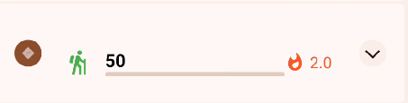
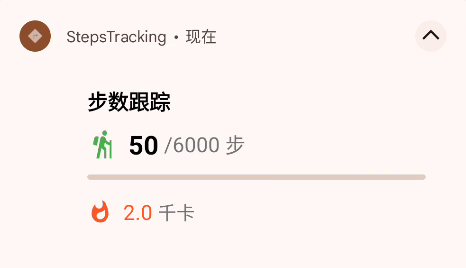
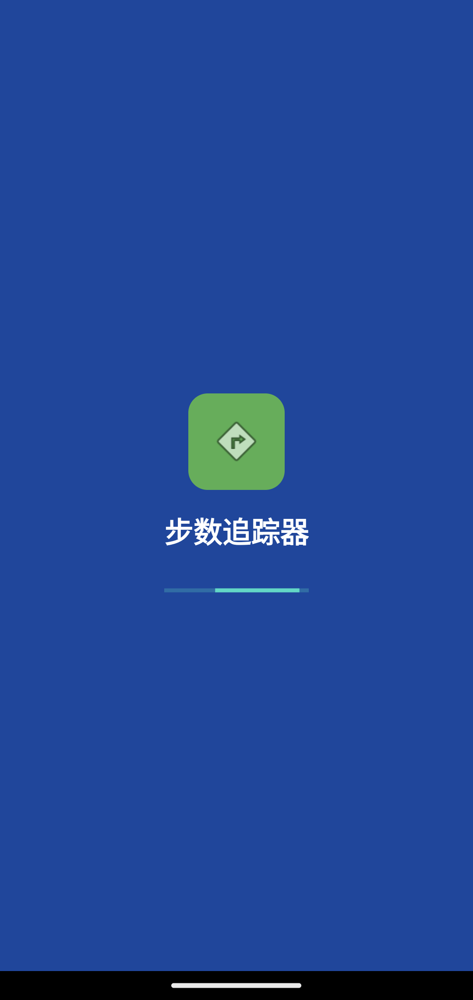
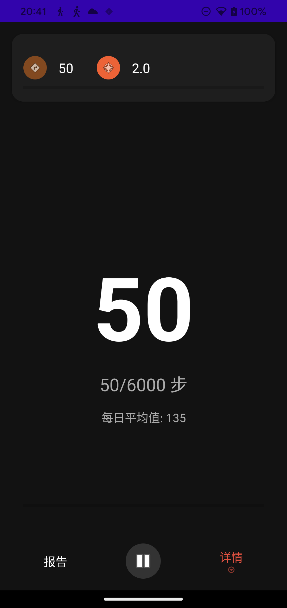
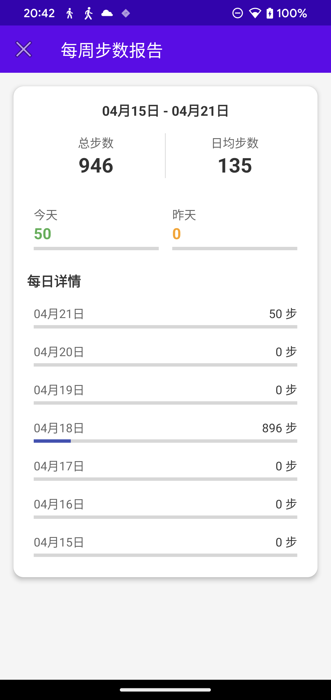

# 📱 Steps Tracking App

## 🚶‍♂️ Project Introduction

Steps Tracking App is a health-focused Android application designed to record and analyze users' daily step counts. With a clean interface and efficient data management, the app helps users easily monitor their daily activity levels.

## ✨ Key Features

- **Real-time Step Counting**: Records user steps using the device's built-in sensors
- **Calorie Calculation**: Automatically calculates calories burned based on step count
- **Daily Goals**: Default goal of 6,000 steps, customizable to user preference
- **Daily Reset**: Automatically resets step count at midnight
- **Weekly Statistics**: Records and displays step data for the past week
- **Health Connect Integration**: Supports Google Health Connect service integration
- **Foreground Service Notification**: Displays current steps and progress

## 📱 App Screenshots

<div align="center">
<table>
  <tr>
    <td></td>
    <td></td>
  </tr>
  <tr>
    <td></td>
    <td></td>
  </tr>
  <tr>
    <td></td>
    <td></td>
  </tr>
</table>
</div>

## 🔧 Technical Architecture

- Programming Language: Kotlin
- Design Patterns: MVVM, Singleton, Repository
- Core Components: Android Sensor API, Foreground Service, Health Connect API
- UI Components: ConstraintLayout, CardView, ProgressBar

## 💻 Environment Requirements

### Development Environment

| Tool | Minimum Version                 |
| --- |---------------------------------|
| Android Studio | Meerkat Feature Drop 2024.3.2 RC 2 |
| Gradle | 8.13 or higher                   |
| JDK | 21                              |

### Target SDK Versions

| SDK Type | Version |
| --- | --- |
| Compile SDK | 35 (Android 15) |
| Minimum SDK | 26 (Android 8.0 Oreo) |
| Target SDK | 35 (Android 15) |

### Device Requirements

- Android 8.0 (API 26) or higher Android device
- Device must have a step counter sensor (STEP_COUNTER)
- Google Health Connect app installation recommended for more accurate step data

## 🔐 Permissions Required

The application requires the following permissions to function properly:

| Permission | Purpose |
| --- | --- |
| `ACTIVITY_RECOGNITION` | Access step sensor data |
| `FOREGROUND_SERVICE` | Keep step counting service running in background |
| `POST_NOTIFICATIONS` | Display notifications on Android 13+ |
| `health.READ_STEPS` | Read step data from Health Connect service |
| `health.WRITE_STEPS` | Write step data to Health Connect service |
| `BODY_SENSORS` | Access body sensor data |

## 📂 Application Module Structure

```
app/
├── src/
│   ├── main/
│   │   ├── java/com/example/stepstracking/
│   │   │   ├── MainActivity.kt             # Main interface, displays current steps and statistics
│   │   │   ├── HealthStepsActivity.kt      # Health Connect integration interface
│   │   │   ├── StepsRepository.kt          # Data repository, manages step data
│   │   │   ├── StepsTrackingService.kt     # Foreground service, records and updates steps
│   │   │   ├── SplashActivity.kt           # Launch screen and permission handling
│   │   │   └── MainViewModel.kt            # Main view model, handles UI logic
│   │   └── res/                            # Resources directory
│   └── ...
└── ...
```

## 🚀 Build and Installation

1. Open the project in Android Studio
2. Check dependency versions in the `build.gradle.kts` file
3. Connect an Android device or start an emulator
4. Click the "Run" button to build and install the app

> **Tip**: The app will request necessary permissions when first launched, please allow them for full functionality.

## ⚠️ Limitations and Known Issues

- Some devices without step sensors may not function properly
- Background step counting may be affected by system optimizations on certain manufacturer devices
- Health Connect functionality requires the Google Health Connect app to be installed

## ✅ Compatibility Testing

The app has been tested on the following environments:

| Android Version | Status |
| --- | --- |
| Android 8.0 (Oreo) | ✅ Pass |
| Android 9.0 (Pie) | ✅ Pass |
| Android 10 | ✅ Pass |
| Android 11 | ✅ Pass |
| Android 12 | ✅ Pass |
| Android 13 | ✅ Pass |
| Android 14 | ✅ Pass |
| Android 15 | ✅ Pass |

## 👥 Contributions and Feedback

Bug reports, feature suggestions, or code contributions are welcome. Please participate in project improvement through GitHub Issues or Pull Requests.

## 📜 Open Source License

This project is licensed under the MIT License. See the LICENSE file for details.

## 📝 Change Log

### Version 1.0
- Initial release
- Basic step tracking functionality
- Health Connect integration
- Weekly statistics support

---

*Keep walking, stay healthy! 🚶‍♀️🚶‍♂️*